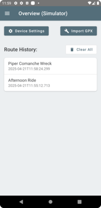
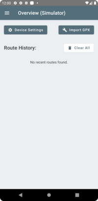
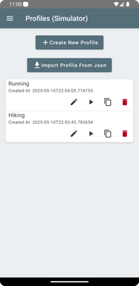
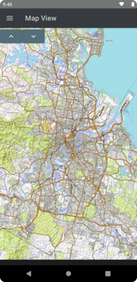
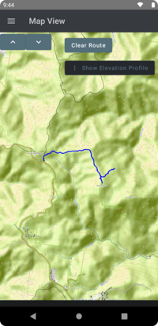
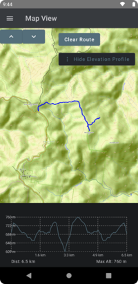
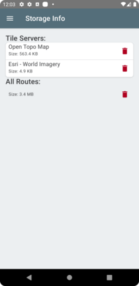
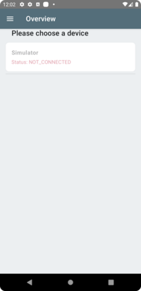
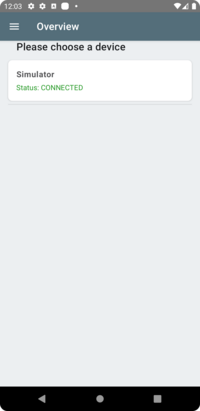

# Prerequisites

The [garmin connect app](https://play.google.com/store/apps/details?id=com.garmin.android.apps.connectmobile&hl=en_AU) must be installed to send routes to your device or configure the device settings. The tile server cannot be used without installing garmin connect. A warning will be show on the device selection screen, and a prompt when you open the app if garmin connect is not installed or up to date.  
The watch app will also need a bluetooth connection with the phone in order to send routes and load map tiles from the companion app (or directly from internet);

# Adding A Gpx Route To The Watch

From Google Maps - You can create some directions and the click 'Share Directions'. The breadcrumb app should be listed as an app that you can share the directions too. Sometimes it is hidden under multiple 'more' buttons.  
Import a file - Open the breadcrumb app and select 'Import GPX', a file browser will be launched that you can select the route from.  
Open A Gpx File - When opening a gpx file select 'open with' and pick the breadcrumb app.  
Komoot - Similar to google maps, from the komoot app got to saved routes, select a route and `share with link`. The breadcrumb app should appear in the available app list to share with. You can also download the gpx route and open it through other means.  
WorldTopoMap App - Go To the tracks section, and click the info button on a track. There is then a `...` menu at the top. Select share, and then the breadcrumb app.  

The `ShareWith` functionality should work with any app that shares a gpx route. Please let me know if there is an app that does not work and I will try to add support for it (if I can access the app without a subscription).

Once added routes can be seen in the [Routes Page](#routes-page)

# Overview Page

The overview page is the main entrypoint of the app, it allows you to import a gpx file from your local storage, or configure a connected devices settings. The route history section shows when each route has been loaded onto the device, and allows a quick way to load routes from the past again (by tapping the route in the history section). The clear all button allows you to empty the route history.
Like the routes page the buttons are.  
* Pin - Show the route on [Map View Page](#map-view-page)
* Play - Send the route to the watch
* Bin - Delete the history item

Note: The `clear all` button only clears route history, it does not remove the routes, if you wish to remove routes use the [Routes Page](#routes-page).  

---

# Devices Page

The page for selecting which device to interact with. The selected device will appear in the title bar on all app pages. A device can only be selected when it is connected, the selected device will be highlighted. The cog next to the device can be touched to open the device settings for the breadcrumb datafield.  

---

# App Settings Page

Configure the app settings. Note some of the tile server settings will clear the maps cache on the watch, use with care if you do not want to loose cached tiles on the watch.  

### Phone Hosted Tile Server

The phone hosts a tile server for the watch to query tiles from. The tiles downloaded are cached locally on the phone for use with offline map support. To stop the tile server (and stop getting the 'tile server running' notifications), you need to close the app, not just background it. ie. open recent apps draw on android and swipe the app away to close it.    

Tile Server Enabled - enable/disable the tile server. You may want to disable the tile server if you are using a templated url on the watch, and not using the companion app to host offline tiles. This will remove some notifications, and not start the tile server process.
Tile Type - Different ways of sending tiles to the watch, note: full colour may need a smaller tile size on the watch (64 was too large in some of my testing).  
Add Custom Server - Manually configure a tile server for use on the companion app, this tile server will be added to the  'Select Server' dropdown.  
Select Server - Select the tile server you wsh the companion app to serve tiles from.
Auth Token - will be used for any tile server that specifies '{authToken}' in the template url.

---

# Profiles Page

Allows saving app and watch settings for later use, and allows quick switching between different settings profiles for different activity types. Profiles can be created from the current settings, or imported from json. See the [profile examples](profiles.md) for importing. When importing from json, you will be prompted for auth tokens for the app and watch when needed (if the tile server requires auth).  
Please share your created profiles as a [github issue](https://github.com/pauljohnston2025/breadcrumb-mobile/issues/new). Ensure that any sensitive data is removed before sharing. Include details such as what activity you use it for and what watch your using. I will add some of these as examples to help other users easily find them, it will also help me see how different users are using the app (and determine what features are more important).  

Icons can be clicked to do the following:

* Pencil - Edit the profile name and optionally reload the settings from the app or watch to update the profile to the currently configured settings.  
* Play - Apply the profiles settings to the watch and companion app.
* Copy - Copy the profile json to clipboard for sharing with other users, or saving for later use. Please ensure no private information such as auth tokens are included when sharing the profile json. 
* Bin - Delete the profile.

Steps to create a profile from a currently configured watch and companion app
1. Click the 'create new profile' button
1. Give the profile a name and click save 

Steps to import a profile from json
1. Click the 'import from json' button
1. Paste the json profile into the text box
1. Set any auth tokens
1. Click save

Steps to update a profile
1. Load the profile using the play button (this puts the profile onto the watch and companion app)
1. Edit settings on the watch and/or the companion app. Eg. Change the tile server on the companion app and the track colour on the watch app. The watch settings can be edited directly on the watch, through garmin connect or by using the companion app.  
1. Once all settings edits are complete and you are happy, click the pencil icon on the profile you wish to update. This will generally be the profile you started with but can be any profile.
1.  Click the 'load watch settings' toggle and/or the 'load app settings' toggle.
1.  Click save. The new settings will be pulled from the watch and/or the app depending on the options chosen in the previous step.

---

# Device Settings Page

This page is able to be accessed from two locations, the overview page (by clicking device settings), or the devices page (by clicking the settings cog next to the device). The device settings page is for configuring the on watch settings, it is similar to garmins connectiq settings, but more cusotomized eg. colour pickers. It also supports editing the per route settings (array settings are currently not suported through connectiq settings). For information on each of the settings see [Connect Iq Settings](https://github.com/pauljohnston2025/breadcrumb-garmin/blob/master/settings.md#garmin-settings-connect-iq-store)  
All the settings from connectiq are available, and the routes can be edited (unlike on the Garmin connect settings).   

---

# Map View Page

A map view for displaying the routes that have been imported, preview a route before sending it to your device. 

Feature still in beta:
Known issues:
* map panning does not work

Features to come:
* cache tile layers around a route
* better ui
* cache tile layers for any panned to area
* tile server attribution
* maybe display route name on the map like the watch does

What does work:
* zooming in and out
* displaying route on map

---

# Storage Info Page

Shows storage information, and allows removal of each storage type. Drag down from the top to refresh. 
The tiles server section shows the storage used by the cached tiles. Deleting tiles will only remove the cached tiles, not the tile server itself. see [App Settings](#app-settings-page) if you wish to remove custom tile servers.
Note: All routes deletion will remove all routes if you click the bin icon. This is not reversible, use with care.  

---

# Routes Page

Shows all of the routes that have been added see [Adding A Gpx Route To The Watch](#adding-a-gpx-route-to-the-watch).  
  

Icons can be clicked to do the following:

* Pencil - Edit the route name
* Pin - Show the route on [Map View Page](#map-view-page)
* Play - Send the route to the watch
* Bin - Delete the route and associated storage

---

# Device Select Page

Appears whenever there is not an active device and we try and communicate with a device. The device can only be selected if it is connected. The active device is show in the title bar and on the devices page.       

---

# Debug Info Page

Shows all of the app logs, to aid in debugging whilst away from a computer. Please include screenshots or an export of this page when making a bug report. Ensure you obfuscate any personal information such as locations or tile server calls (location can be roughly calculated from tile coordinates).

---
